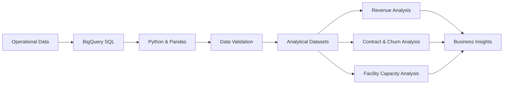
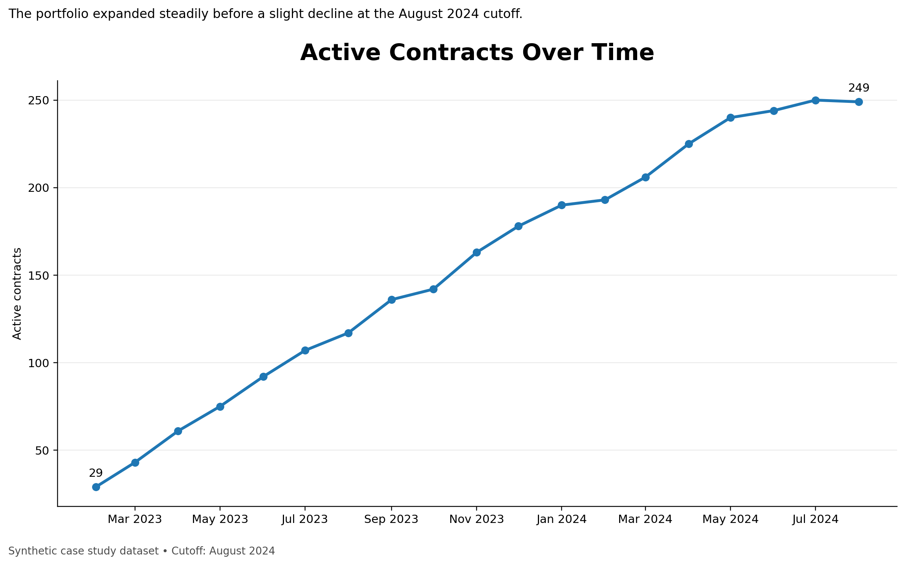
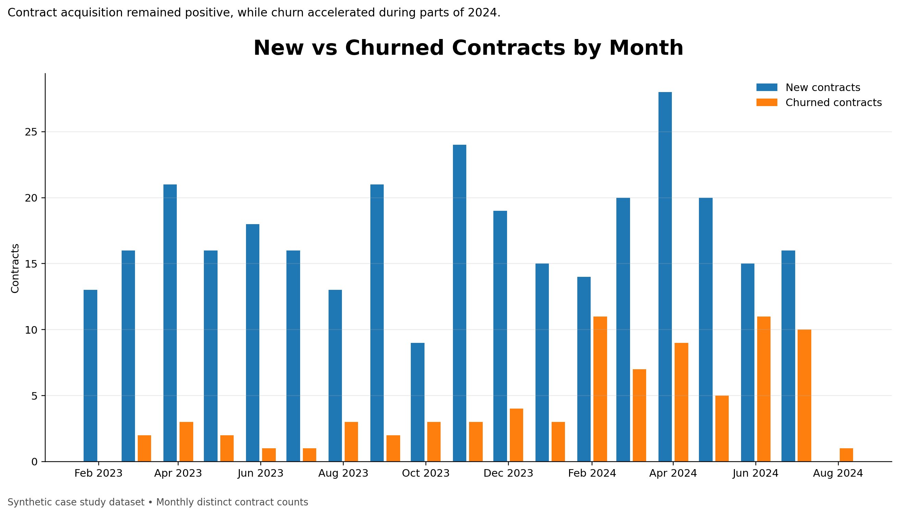
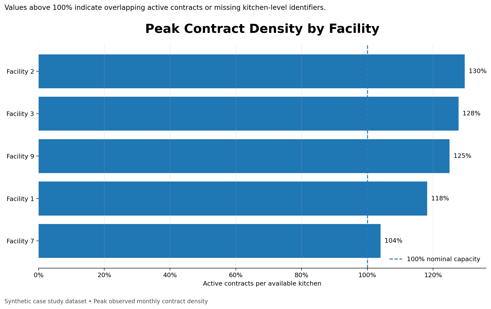
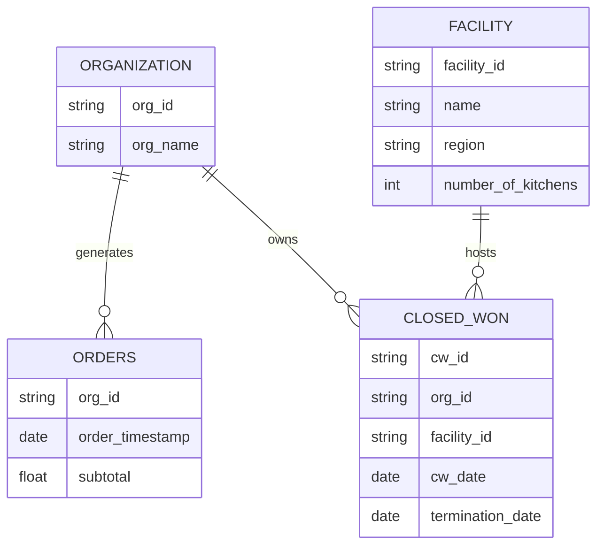

# Restaurant Operations & Revenue Analytics


An end-to-end analytics project focused on restaurant performance, contract growth, churn, facility utilisation and expansion opportunities.

The analysis combines SQL, BigQuery, Python and Jupyter Notebook to transform operational data into business insights for both executive and operational decision-making.

---

## Project Overview

Restaurant operations depend on the ability to balance revenue growth, contract retention and facility capacity.

This project analyses a synthetic and anonymised restaurant operations dataset to answer questions related to:

* contract acquisition and churn;
* restaurant revenue performance;
* regional GMV concentration;
* expansion eligibility;
* facility-level revenue;
* kitchen capacity and contract density;
* data quality and modelling limitations.

The project was designed to support two different audiences:

* **Leadership:** business performance, growth, churn and regional priorities;
* **Operations:** facility utilisation, contract activity and restaurant-level opportunities.

---

## Business Questions

The analysis was structured around five main business questions:

1. How many contracts were created historically, and how many remain active?
2. Which restaurants generate the highest current and historical GMV?
3. Which restaurants are eligible for expansion?
4. Which facilities generate the highest GMV?
5. What percentage of each facility's kitchen capacity is currently occupied?

---

## Analytical Workflow



The analytical workflow included:

* extracting operational tables from BigQuery;
* transforming date and numerical fields;
* aggregating GMV by restaurant, region and facility;
* calculating monthly contract activity;
* measuring churn over time;
* identifying expansion candidates;
* validating facility capacity and contract density;
* producing visual insights with Python and Matplotlib.

---

## Key Metrics

| Metric                | Description                                                                    |
| --------------------- | ------------------------------------------------------------------------------ |
| Historical Contracts  | Total distinct contracts created over time                                     |
| Active Contracts      | Contracts active at the end of each month                                      |
| New Contracts         | Contracts created during the reference month                                   |
| Churned Contracts     | Contracts terminated during the reference month                                |
| Churn Rate            | Monthly churned contracts divided by the previous month's active contract base |
| Current GMV           | GMV generated during the latest three-month period                             |
| Historical GMV        | Total GMV generated across the full dataset                                    |
| Expansion Eligibility | Restaurants exceeding the GMV and contract-age thresholds                      |
| Contract Density      | Active contracts divided by the number of kitchens within a facility           |

---

## Key Insights

### Contract Growth

The active contract base expanded consistently throughout most of the analysed period, showing sustained commercial growth before a small decline at the August 2024 cutoff.



---

### New Contracts vs Churn

New contract acquisition remained positive throughout the period, although churn became more volatile during 2024.



---

### Churn Rate

Monthly churn remained relatively controlled throughout most of 2023 but became more volatile in 2024, reaching a peak of **5.8% in February**.

Elevated churn levels were also observed between April and July, indicating a period of increased contract instability and a potential need for stronger retention initiatives.

Churn rate was calculated as the number of contracts terminated during the month divided by the active contract base at the end of the previous month.


> August should not be interpreted as a confirmed churn improvement because the dataset uses an August 2024 cutoff and the final period may be incomplete.

---

### Regional Performance

Current GMV is concentrated in the **East region**, followed by West and North, while South shows the lowest current performance.

* East: approximately **$5.70M**
* West: approximately **$4.79M**
* North: approximately **$4.25M**
* South: approximately **$2.77M**


This regional concentration can support resource allocation, commercial prioritisation and expansion planning.

---

### Restaurant Performance

Restaurant performance was evaluated using both current and historical GMV.

Independent rankings were created by region to avoid relying exclusively on cumulative historical performance and to identify restaurants currently gaining or losing commercial relevance.


---

### Expansion Opportunities

A restaurant was considered eligible for expansion when:

* monthly GMV exceeded **$45,000**;
* more than **100 days** had passed since the organisation's latest contract.

Using these business rules, **25 restaurants** were identified as potential expansion candidates.

This approach combines commercial performance with contract recency, helping prioritise restaurants with proven demand and no recent expansion activity.

---

### Facility Capacity and Contract Density

Several facilities presented contract density above 100%.



This does not necessarily mean that the physical kitchen capacity was exceeded.

The result may indicate:

* more than one active contract assigned to the same kitchen;
* overlapping contract start and termination dates;
* contracts remaining active in the source system after operational replacement;
* missing kitchen-level identifiers.

The available dataset contains facility and contract identifiers, but no individual `kitchen_id`. Without a one-to-one relationship between kitchens and contracts, physical occupancy cannot be fully validated.

For this reason, the metric is presented as **contract density** rather than confirmed physical occupancy.

---

## Data Model

The project uses four primary operational entities:

| Table          | Purpose                                                                 |
| -------------- | ----------------------------------------------------------------------- |
| `closed_won`   | Contract creation, termination, organisation and facility relationships |
| `orders`       | Restaurant order activity and GMV                                       |
| `organization` | Restaurant and organisation information                                 |
| `facility`     | Facility location, region and kitchen capacity                          |

The contract table acts as the main relationship between restaurants and facilities.



---

## Data Preparation

The main preparation steps included:

* converting contract and termination fields into date formats;
* parsing order timestamps;
* casting GMV fields into numerical values;
* using distinct counts to avoid duplicated contracts;
* generating monthly date ranges;
* identifying active contracts at the end of each month;
* aggregating revenue by restaurant, region and facility;
* ranking restaurants independently by current and historical GMV;
* calculating days since the most recent contract;
* combining facility capacity with active contract counts.

---

## Technology Stack

* **Python** — data transformation and analytical logic
* **Pandas** — dataframe manipulation and aggregation
* **SQL** — data extraction, joins and business-rule implementation
* **Google BigQuery** — analytical database and query execution
* **Jupyter Notebook** — analysis documentation and reproducibility
* **Matplotlib** — analytical visualisation

---

## Repository Structure

```text
restaurant-operations-revenue-analytics/
│
├── README.md
├── restaurant_operations_revenue_analytics.ipynb
│
├── assets/
│   ├── 01_active_contracts_over_time.png
│   ├── 02_new_vs_churned_contracts.png
│   ├── 03_top_restaurants_current_gmv.png
│   ├── 04_peak_contract_density_by_facility.png
│   ├── restaurant_ops_region_treemap.png
│   └── restaurant_ops_churn_rate_over_time.png
│
└── data/
    └── processed_data.csv
```

---

## Business Applications

The analytical framework can support:

* contract retention strategies;
* churn monitoring;
* restaurant expansion prioritisation;
* regional commercial planning;
* facility capacity management;
* revenue concentration analysis;
* data quality investigation;
* executive performance reporting.

---

## Data Privacy

This repository uses an anonymised and synthetic case study dataset.

Company references, credentials and original infrastructure identifiers were removed before publication. Facility and restaurant names are fictional and do not represent real commercial entities.

---

## Author

**Arthur Fermino Franca**

Data Analytics | Business Intelligence | Artificial Intelligence | Operations Analytics
